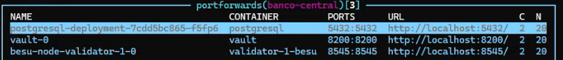

Previo a ejecución:

Desde k9s crear un portforward a Vault, posgres y un nodo validador

En una aterminal cargar la imgen wsl de Ubuntu-BCC.tar

Ejecucion:

Desde la imagen wsl ubicarse en el Directorio /api/api-off-chain

ejecutar:

1 - npm run build

2 - npm start

En otra terminal wsl ubicarse en el Directorio /api/servicio:

1 - npm run build

2 - npm start

Una vez terminado las dos ejecucion

Cargar un contrato o ejecutar una transaccion en la red.
Explorar la base de datos de postgres, Visualizando los eventos.